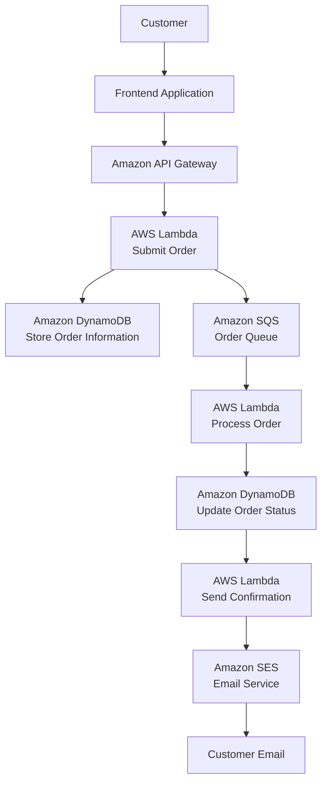

# Architecture

The system is designed around an asynchronous event-driven workflow using AWS managed services.

The architecture separates components to improve scalability, reliability, and maintainability.

---

# Request Flow

---

# Architecture Design Principles

The solution follows AWS cloud-native architecture principles:

## Serverless

No servers are managed manually. AWS services automatically handle infrastructure provisioning, scaling, and availability.

## Event-Driven Processing

Amazon SQS separates order submission from order processing, allowing the system to process requests asynchronously.

## Scalability

AWS Lambda automatically scales based on workload demand, while DynamoDB provides high-performance NoSQL storage.

## Reliability

The architecture uses managed AWS services with built-in fault tolerance and monitoring capabilities.

## Cost Efficiency

Resources are consumed only when required, reducing operational costs compared with traditional server-based applications.

---

# AWS Services Used

## Amazon S3

Used for hosting the frontend static website.

Responsibilities:

- Hosts frontend files
- Provides scalable static website hosting
- Integrates with the serverless backend

---

## Amazon API Gateway

Acts as the entry point for customer requests.

Responsibilities:

- Receives HTTP requests
- Routes requests to Lambda functions
- Connects frontend and backend services

---

## AWS Lambda

Three Lambda functions manage the workflow:

### SubmitOrderFunction

Responsibilities:

- Receives customer orders
- Validates request data
- Stores order information
- Sends messages to Amazon SQS

### ProcessOrderFunction

Responsibilities:

- Processes asynchronous messages
- Updates order status
- Triggers confirmation workflow

### SendConfirmationFunction

Responsibilities:

- Generates email notifications
- Sends confirmation emails using Amazon SES

---

## Amazon DynamoDB

NoSQL database used to store order records.

Stored information:

- Order ID
- Customer name
- Email
- Product
- Quantity
- Status
- Creation timestamp

---

## Amazon SQS

Provides asynchronous communication between services.

Benefits:

- Decouples application components
- Improves reliability
- Handles traffic spikes

Queues:

- OrderQueue
- OrderDLQ

---

## Amazon SES

Used for sending customer confirmation emails.

Workflow:

Lambda → SES → Customer Email

---

## Amazon CloudWatch

Provides monitoring and observability.

Used for:

- Lambda execution logs
- Troubleshooting
- Application monitoring
