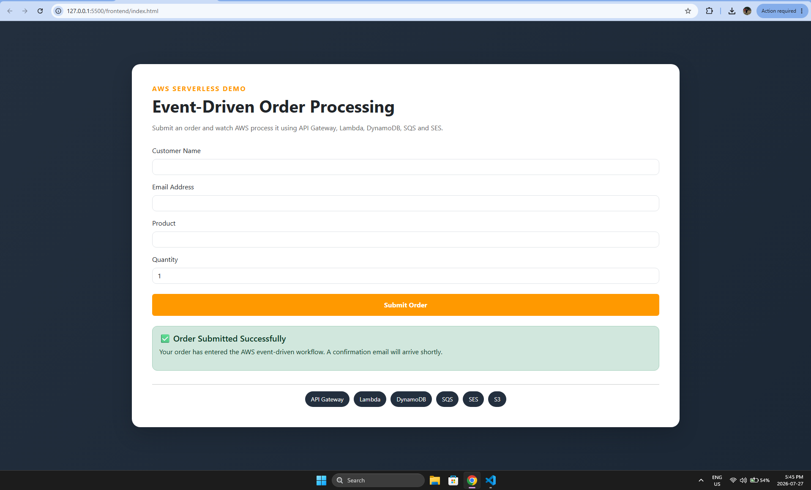
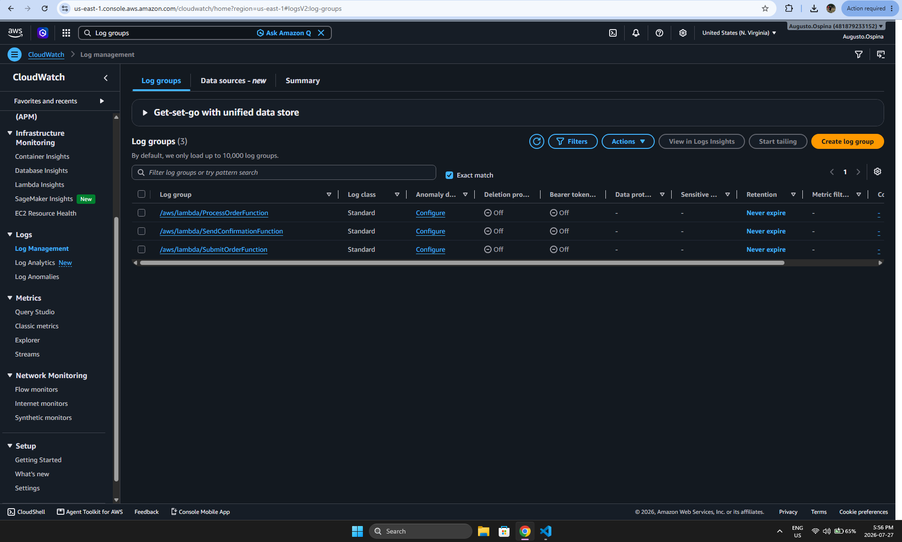

# AWS Serverless Event-Driven Order Processing System


A production-style serverless order processing application built entirely on AWS using an event-driven architecture.

This project demonstrates how modern cloud-native applications can use managed AWS services to build scalable, highly available, asynchronous, and cost-effective systems without managing traditional servers.

---

# Project Overview

Customers submit orders through a web application hosted on the frontend.

The request is processed through an AWS serverless workflow:

1. User submits an order through the web interface.
2. Amazon API Gateway receives the request.
3. AWS Lambda validates and processes the order.
4. Order information is stored in Amazon DynamoDB.
5. Amazon SQS provides asynchronous message processing.
6. A processing Lambda updates the order status.
7. Amazon SES sends an email confirmation.
8. Amazon CloudWatch provides monitoring and logging.

The architecture follows cloud best practices by using:

- Serverless computing
- Event-driven processing
- Managed AWS services
- Loose coupling between components
- Scalable architecture design

---

# Architecture


The system is designed around an asynchronous event-driven workflow.

## Request Flow

```
Customer
   |
   v
Frontend Application
   |
   v
Amazon API Gateway
   |
   v
AWS Lambda (Submit Order)
   |
   +----------------+
   |                |
   v                v
DynamoDB        Amazon SQS
                    |
                    v
              AWS Lambda
              (Process Order)
                    |
                    v
              DynamoDB Update
                    |
                    v
              AWS Lambda
              (Send Confirmation)
                    |
                    v
              Amazon SES
                    |
                    v
              Customer Email
```

---

# AWS Services Used

## Amazon S3

Used for hosting the frontend static website.

Responsibilities:

- Hosts frontend files
- Provides scalable static website hosting
- Integrates with AWS serverless architecture

---

## Amazon API Gateway

Acts as the REST API entry point.

Responsibilities:

- Receives customer requests
- Routes requests to Lambda functions
- Provides secure communication between frontend and backend

---

## AWS Lambda

Three Lambda functions handle the application workflow:

### SubmitOrderFunction

Responsibilities:

- Receives order requests
- Validates input data
- Stores initial order information
- Sends messages to SQS


### ProcessOrderFunction

Responsibilities:

- Processes asynchronous order events
- Updates order status
- Triggers confirmation workflow


### SendConfirmationFunction

Responsibilities:

- Generates confirmation email
- Sends notification through Amazon SES

---

## Amazon DynamoDB

NoSQL database used for storing order information.

Stored attributes:

- Order ID
- Customer Name
- Email
- Product
- Quantity
- Status
- Created Date

---

## Amazon SQS

Provides asynchronous message processing.

Benefits:

- Decouples application components
- Improves reliability
- Handles workload spikes

Queues used:

- OrderQueue
- OrderDLQ

---

## Amazon SES

Used for sending customer email confirmations.

Workflow:

Lambda → SES → Customer Email

---

## Amazon CloudWatch

Provides monitoring and logging.

Used for:

- Lambda execution logs
- Application monitoring
- Troubleshooting
- Observability

---

# Technologies Used

## Cloud Platform

- Amazon Web Services (AWS)

## Backend

- Python 3.13
- AWS Lambda

## Database

- Amazon DynamoDB

## Messaging

- Amazon SQS

## Email Service

- Amazon SES

## API

- Amazon API Gateway

## Monitoring

- Amazon CloudWatch

## Frontend

- HTML
- CSS
- JavaScript

---

# Project Features

✅ Fully serverless architecture  
✅ Event-driven processing workflow  
✅ Asynchronous order handling  
✅ No server management required  
✅ Scalable AWS services  
✅ Database persistence with DynamoDB  
✅ Email notifications using SES  
✅ Monitoring through CloudWatch  
✅ Dead Letter Queue implementation  
✅ Production-style cloud architecture  

---

# Screenshots

## Homepage

Customer-facing interface where users submit orders into the AWS serverless workflow.


---

## Successful Order Submission

The application confirms that the order was accepted and entered the event-driven processing pipeline.



---

## AWS Lambda Functions

Three Lambda functions manage order validation, processing, and email notification.


---

## Amazon DynamoDB Table

Order records are stored with customer information, product details, and processing status.


---

## Processed Order Record

Example of a completed order stored inside DynamoDB.


---

## Amazon SQS Queues

Shows asynchronous message processing using OrderQueue and OrderDLQ.


---

## Amazon API Gateway

API endpoint responsible for receiving frontend requests.


---

## Amazon CloudWatch Logs

CloudWatch provides monitoring and troubleshooting information from Lambda executions.



---

## Amazon SES Verified Identity

Verified email identity used for sending confirmation messages.


---

## Email Confirmation

Successful customer notification generated through Amazon SES.


---

# Project Validation

The complete workflow was successfully tested:

✅ Order submitted through frontend  
✅ API Gateway received request  
✅ Lambda validated order data  
✅ DynamoDB stored order information  
✅ SQS handled asynchronous processing  
✅ Processing Lambda updated order status  
✅ SES generated confirmation email  
✅ Customer received notification  
✅ CloudWatch captured application logs  

---

# Skills Demonstrated

This project demonstrates practical experience with:

- AWS serverless architecture
- Cloud infrastructure design
- Event-driven systems
- AWS Lambda development
- DynamoDB database operations
- API Gateway configuration
- SQS messaging patterns
- SES email integration
- CloudWatch monitoring
- Troubleshooting AWS services

---

# Future Improvements

Possible enhancements:

- Add authentication using Amazon Cognito
- Add Infrastructure as Code using AWS CloudFormation or Terraform
- Add CI/CD deployment pipeline using GitHub Actions
- Add frontend hosting through Amazon CloudFront
- Add automated testing
- Add API security with authentication and authorization

---

# License

This project is licensed under the MIT License.
