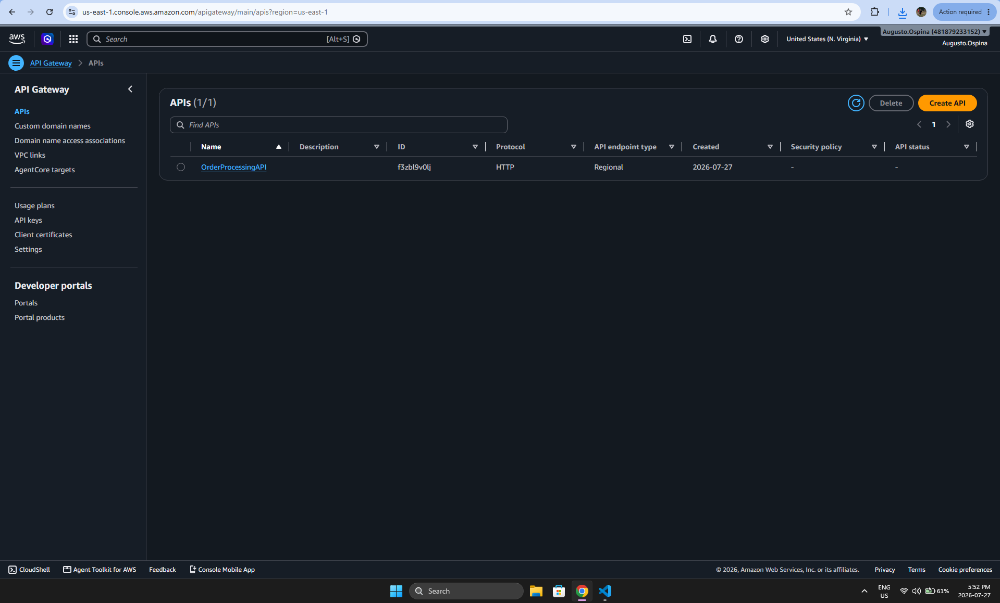

# AWS Serverless Event-Driven Order Processing System

A fully serverless event-driven application built on AWS using modern cloud-native architecture.

## Project Overview

This project demonstrates how to build a scalable serverless application using AWS services.

Customers submit orders through a web application hosted on Amazon S3.

The request flows through API Gateway into AWS Lambda, stores the order inside DynamoDB, sends a message to Amazon SQS, processes the order asynchronously, updates its status, and finally sends a confirmation email using Amazon SES.

---

## Architecture


---

## Technologies Used

- Amazon API Gateway
- AWS Lambda
- Amazon DynamoDB
- Amazon SQS
- Amazon SES
- Amazon S3
- CloudWatch
- HTML
- CSS
- JavaScript

---

## Features

- Serverless architecture
- Event-driven processing
- Asynchronous order workflow
- REST API
- No servers to manage
- Automatic order confirmation emails
- CloudWatch logging
- Static website hosting with Amazon S3

---

## Workflow

Customer

↓

Amazon S3 Static Website

↓

API Gateway

↓

SubmitOrder Lambda

↓

DynamoDB

↓

Amazon SQS

↓

ProcessOrder Lambda

↓

Update Order Status

↓

SendConfirmation Lambda

↓

Amazon SES

↓

Customer Email

---

## Screenshots

### Web Application


### API Gateway



### DynamoDB


### Amazon SQS


### Amazon SES


### Amazon S3


### CloudWatch


---

## Project Structure

```
frontend/
lambda/
diagrams/
screenshots/
README.md
```

---

## Future Improvements

- User authentication
- Payment integration
- Order history
- Admin dashboard
- CloudFormation deployment
- CI/CD pipeline
- Custom domain
- HTTPS with CloudFront

---

## Author

Augusto Ospina

LinkedIn:
(Add your LinkedIn)

GitHub:
https://github.com/Augusto-Ospina10
