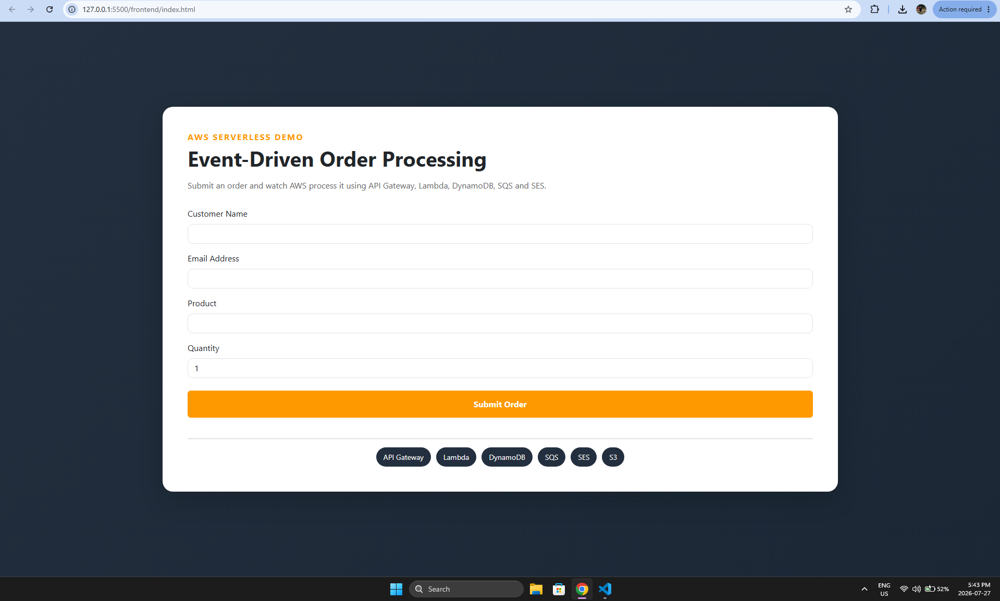
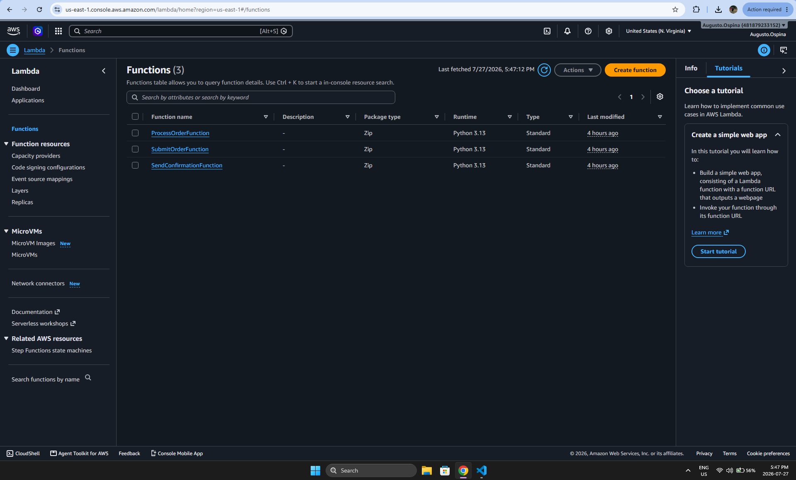
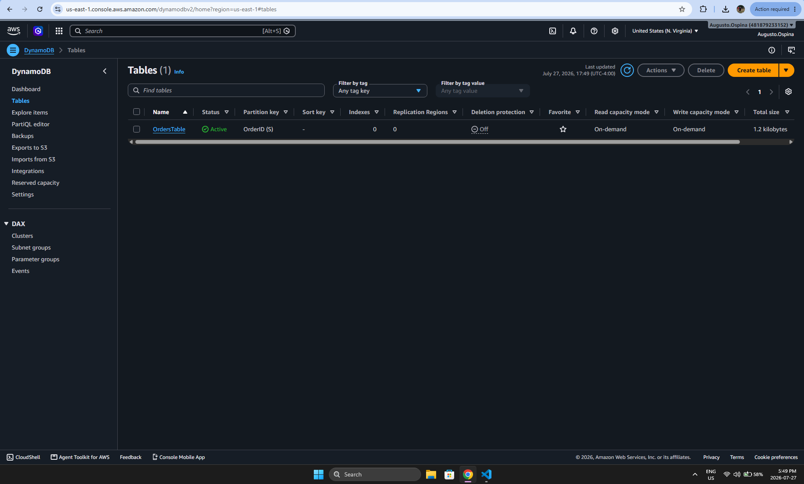
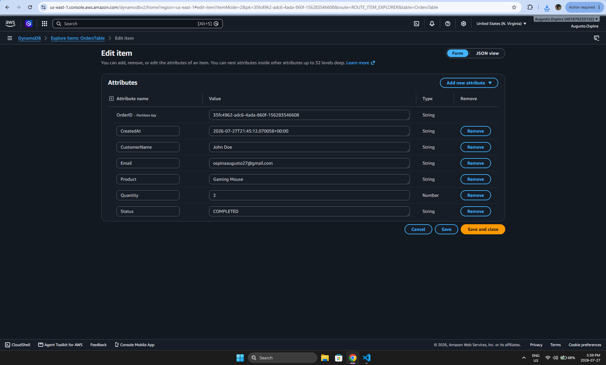
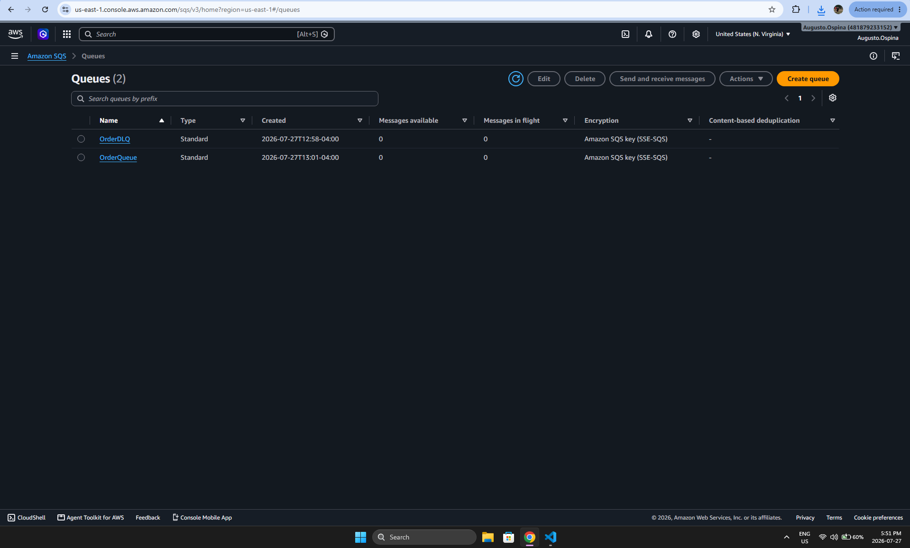
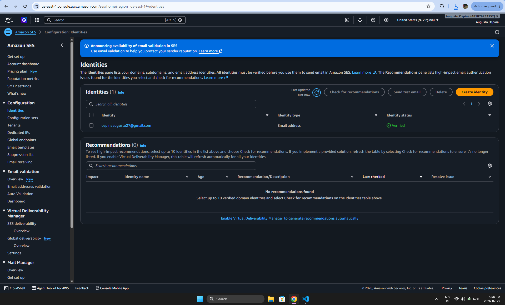
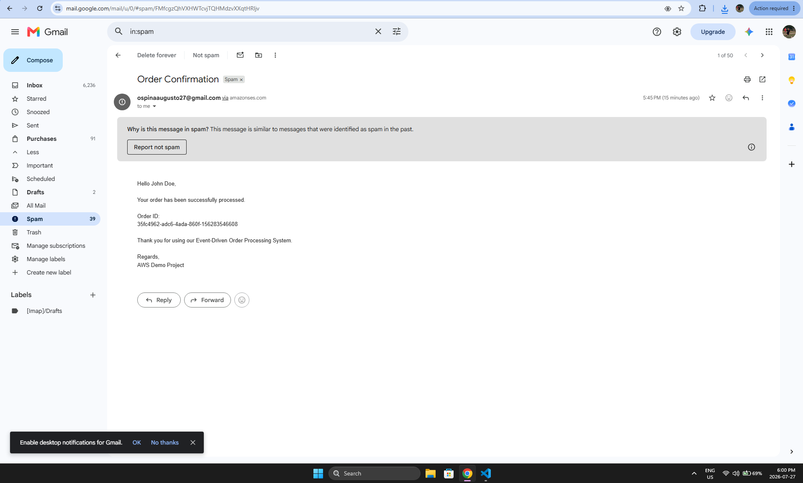

# AWS Serverless Event-Driven Order Processing System


A production-style serverless order processing application built entirely on AWS using an event-driven architecture.

This project demonstrates how modern cloud-native applications can leverage managed AWS services to build scalable, highly available, asynchronous, and cost-effective systems without managing servers.

---

# Project Overview

Customers place orders through a web application hosted on Amazon S3.

The request flows through Amazon API Gateway into AWS Lambda, where the order is validated, stored inside Amazon DynamoDB, and published to Amazon SQS for asynchronous processing.

A second Lambda function processes the order, updates its status inside DynamoDB, invokes a third Lambda function, and sends a confirmation email through Amazon SES.

CloudWatch provides monitoring and logging for the entire workflow.

---

# Architecture

<p align="center">

</p>

---

# Features

- Serverless REST API built with Amazon API Gateway
- Static website hosting using Amazon S3
- Business logic implemented with AWS Lambda
- Order persistence using Amazon DynamoDB
- Asynchronous event-driven processing using Amazon SQS
- Email notifications using Amazon SES
- Monitoring and centralized logging with Amazon CloudWatch
- Fully managed AWS infrastructure
- Highly scalable architecture
- Decoupled microservice design

---

# Event Flow

```text
Customer

↓

Amazon S3 Static Website

↓

Amazon API Gateway

↓

SubmitOrder Lambda

↓

Amazon DynamoDB

↓

Amazon SQS

↓

ProcessOrder Lambda

↓

Update DynamoDB

↓

SendConfirmation Lambda

↓

Amazon SES

↓

Customer receives confirmation email
```

---

# AWS Services Used

| AWS Service | Purpose |
|-------------|---------|
| Amazon S3 | Static website hosting |
| Amazon API Gateway | REST API endpoint |
| AWS Lambda | Serverless business logic |
| Amazon DynamoDB | NoSQL database |
| Amazon SQS | Asynchronous message queue |
| Amazon SES | Email notifications |
| Amazon CloudWatch | Monitoring, logging and observability |

---

# Repository Structure

```text
aws-serverless-order-processing-system
│
├── frontend/
│   ├── index.html
│   ├── script.js
│   └── style.css
│
├── lambda/
│   ├── SubmitOrderFunction.py
│   ├── ProcessOrderFunction.py
│   └── SendConfirmationFunction.py
│
├── diagrams/
│   └── architecture.png
│
├── screenshots/
│
├── README.md
│
└── LICENSE
```

---

# Example Request

```json
{
    "CustomerName": "John Doe",
    "Email": "john@example.com",
    "Item": "Gaming Mouse",
    "Quantity": 1
}
```

---

# Example Response

```json
{
    "message": "Order submitted successfully.",
    "orderId": "c3c2e8b8-7a4b-47f5-90ab-d3e8d74c7f3d"
}
```

---

# Architecture Highlights

## Event-Driven Design

Orders are processed asynchronously through Amazon SQS, allowing services to remain decoupled and improving scalability and reliability.

## Serverless Computing

AWS Lambda automatically scales based on incoming requests without requiring infrastructure management.

## High Availability

The application leverages managed AWS services that automatically provide high availability and fault tolerance.

## Loose Coupling

Each Lambda function performs a single responsibility, making the application easier to maintain and extend.

---

# Monitoring & Observability

Amazon CloudWatch provides:

- Lambda execution logs
- API Gateway request logs
- Error monitoring
- Operational metrics
- Performance monitoring
- Centralized logging

---

# Scalability

This architecture is designed to scale automatically because:

- AWS Lambda automatically scales with incoming traffic
- Amazon API Gateway supports thousands of concurrent requests
- Amazon SQS decouples application components
- Amazon DynamoDB provides virtually unlimited scalability
- Amazon S3 delivers static content globally

---

# Security

The project follows AWS security best practices:

- IAM Roles with least-privilege permissions
- HTTPS communication through API Gateway
- Fully managed AWS services
- Serverless architecture reduces attack surface
- No servers to patch or maintain

---

# Technologies

### AWS

- Amazon S3
- Amazon API Gateway
- AWS Lambda
- Amazon DynamoDB
- Amazon SQS
- Amazon SES
- Amazon CloudWatch
- AWS IAM

### Frontend

- HTML5
- CSS3
- JavaScript (ES6)

---

# Future Improvements

Potential enhancements include:

- User authentication with Amazon Cognito
- Infrastructure as Code using AWS CloudFormation or Terraform
- CI/CD pipeline using GitHub Actions
- Dead Letter Queue monitoring
- Amazon EventBridge integration
- API request validation
- Custom domain with Route 53
- CloudFront CDN distribution
- AWS WAF protection
- Unit and integration testing

---

# Learning Outcomes

This project demonstrates practical experience with:

- Serverless application development
- Event-driven architecture
- AWS managed services
- Cloud-native application design
- Asynchronous message processing
- REST API development
- Cloud monitoring and observability
- Infrastructure scalability
- Production-ready cloud architecture

---

## Screenshots

### Homepage



---

### Successful Order Submission


---

### AWS Lambda Functions



---

### Amazon DynamoDB Table



---

### Processed Order Record



---

### Amazon SQS Queues



---

### Amazon API Gateway


---

### Amazon CloudWatch Logs


---

### Amazon SES Verified Identity



---

### Confirmation Email



---

# Author

**Augusto Ospina**

Cloud Computing Graduate

Aspiring AWS Cloud Engineer

GitHub: https://github.com/Augusto-Ospina10

---

# License

This project is licensed under the MIT License.
