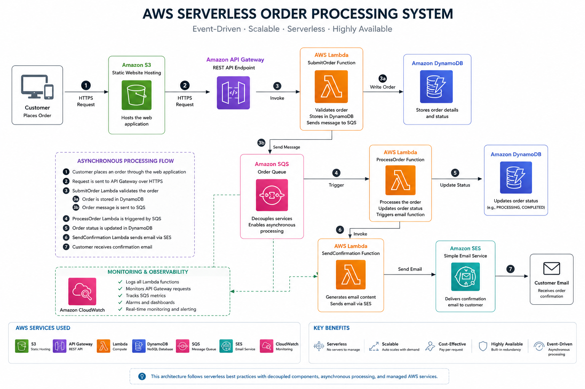

# AWS Serverless Event-Driven Order Processing System


A production-style serverless order processing application built entirely on AWS using an event-driven architecture.

This project demonstrates how modern cloud-native applications can leverage managed AWS services to build scalable, highly available, asynchronous, and cost-effective systems without managing traditional servers.

---

# Project Overview

Customers submit orders through a web application hosted on the frontend.

The request flows through an AWS serverless workflow:

1. Customer submits an order.
2. Amazon API Gateway receives the request.
3. AWS Lambda validates and processes the order.
4. Order information is stored in Amazon DynamoDB.
5. Amazon SQS handles asynchronous processing.
6. A processing Lambda updates the order status.
7. Amazon SES sends an email confirmation.
8. Amazon CloudWatch provides monitoring and logging.

This architecture follows cloud-native best practices by using:

- Serverless computing
- Event-driven design
- Managed AWS services
- Loose coupling between components
- Scalable infrastructure

---

## Architecture



The system uses an asynchronous event-driven architecture where each AWS service performs a specific responsibility.

## Request Flow

```text
Customer
    |
Frontend Application
    |
Amazon API Gateway
    |
AWS Lambda (Submit Order)
    |
    +----------------+
    |                |
DynamoDB        Amazon SQS
                    |
                    |
             AWS Lambda
             (Process Order)
                    |
                    |
             DynamoDB Update
                    |
                    |
             AWS Lambda
             (Send Confirmation)
                    |
                    |
              Amazon SES
                    |
                    |
             Customer Email
```

---

# Architecture Design Principles

## Serverless

The application does not require traditional server management. AWS handles infrastructure scaling, availability, and maintenance.

## Event-Driven Processing

Amazon SQS decouples order submission from processing, allowing asynchronous and reliable communication between components.

## Scalability

AWS Lambda automatically scales based on workload demand, while DynamoDB provides high-performance NoSQL storage.

## Reliability

The architecture uses managed AWS services with built-in fault tolerance and monitoring capabilities.

## Cost Efficiency

Resources are consumed only when required, reducing operational overhead.

---

# AWS Services Used

## Amazon S3

Used for hosting the frontend static website.

Responsibilities:

- Hosts frontend files
- Provides scalable static website hosting
- Serves the customer interface

---

## Amazon API Gateway

Acts as the API entry point.

Responsibilities:

- Receives HTTP requests
- Routes requests to Lambda functions
- Connects frontend and backend services

---

## AWS Lambda

Three Lambda functions handle the application workflow.

### SubmitOrderFunction

Responsibilities:

- Receives customer orders
- Validates input data
- Stores order information
- Sends messages to SQS


### ProcessOrderFunction

Responsibilities:

- Processes asynchronous messages
- Updates order status
- Continues the workflow


### SendConfirmationFunction

Responsibilities:

- Generates confirmation emails
- Sends notifications using Amazon SES

---

## Amazon DynamoDB

NoSQL database used to store order information.

Stored attributes:

- Order ID
- Customer name
- Email
- Product
- Quantity
- Status
- Creation timestamp

---

## Amazon SQS

Provides asynchronous message processing.

Benefits:

- Decouples application components
- Improves reliability
- Handles workload spikes

Queues:

- OrderQueue
- OrderDLQ

---

## Amazon SES

Used for sending customer email confirmations.

Workflow:

Lambda → SES → Customer Email

---

## Amazon CloudWatch

Provides monitoring and logging.

Used for:

- Lambda execution logs
- Troubleshooting
- Application observability

---

# Technologies Used

## Cloud Platform

- Amazon Web Services (AWS)

## Backend

- Python 3.13
- AWS Lambda

## Database

- Amazon DynamoDB

## Messaging

- Amazon SQS

## Email Service

- Amazon SES

## API

- Amazon API Gateway

## Monitoring

- Amazon CloudWatch

## Frontend

- HTML
- CSS
- JavaScript

---

# Project Features

✅ Fully serverless architecture  
✅ Event-driven workflow  
✅ Asynchronous order processing  
✅ DynamoDB database integration  
✅ SQS message queue implementation  
✅ SES email notification system  
✅ CloudWatch monitoring  
✅ Dead Letter Queue support  
✅ Scalable AWS architecture  

---

# Screenshots

## Homepage

Customer-facing interface where users submit orders.


---

## Successful Order Submission

The application confirms that the order entered the AWS processing workflow.


---

## AWS Lambda Functions

Lambda functions responsible for validation, processing, and notifications.


---

## Amazon DynamoDB Table

Stores customer orders and processing information.


---

## Processed Order Record

Example of a completed order stored inside DynamoDB.


---

## Amazon SQS Queues

Shows asynchronous message processing queues.


---

## Amazon API Gateway

API endpoint responsible for receiving frontend requests.


---

## Amazon CloudWatch Logs

Monitoring and logging information from Lambda executions.


---

## Amazon SES Verified Identity

Verified email identity used for sending notifications.


---

## Email Confirmation

Confirmation email generated after successful order processing.


---

# Project Validation

The complete workflow was successfully tested:

✅ Order submitted through frontend  
✅ API Gateway received request  
✅ Lambda validated order data  
✅ DynamoDB stored order information  
✅ SQS handled asynchronous processing  
✅ Processing Lambda updated order status  
✅ SES sent confirmation email  
✅ Customer received notification  
✅ CloudWatch captured execution logs  

---

# Skills Demonstrated

This project demonstrates practical experience with:

- AWS serverless architecture
- Cloud infrastructure design
- Event-driven systems
- AWS Lambda development
- DynamoDB operations
- API Gateway configuration
- SQS messaging patterns
- SES integration
- CloudWatch monitoring
- Cloud troubleshooting

---

# Future Improvements

Possible enhancements:

- Add Amazon Cognito authentication
- Add Terraform or CloudFormation infrastructure as code
- Add CI/CD deployment using GitHub Actions
- Add CloudFront distribution
- Add automated testing
- Improve API security

---

# License

This project is licensed under the MIT License.
